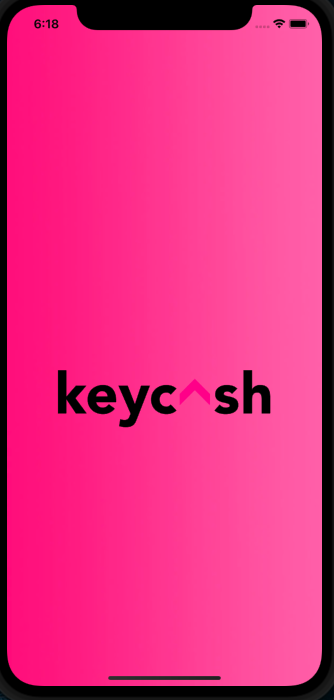
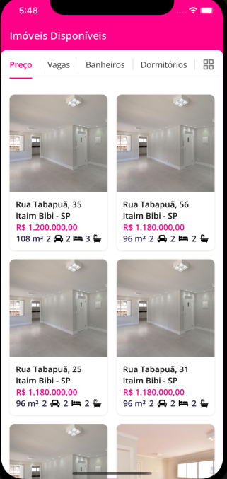
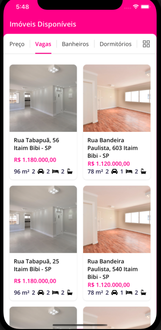
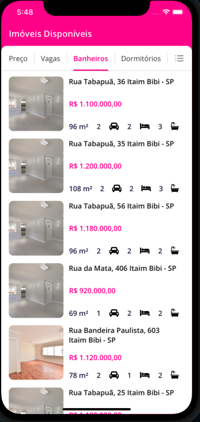
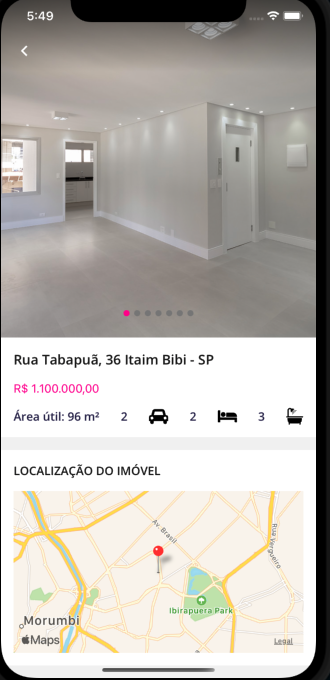
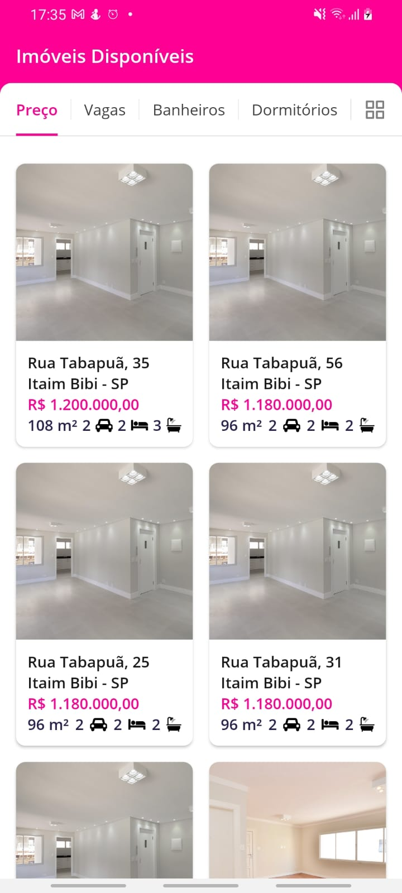
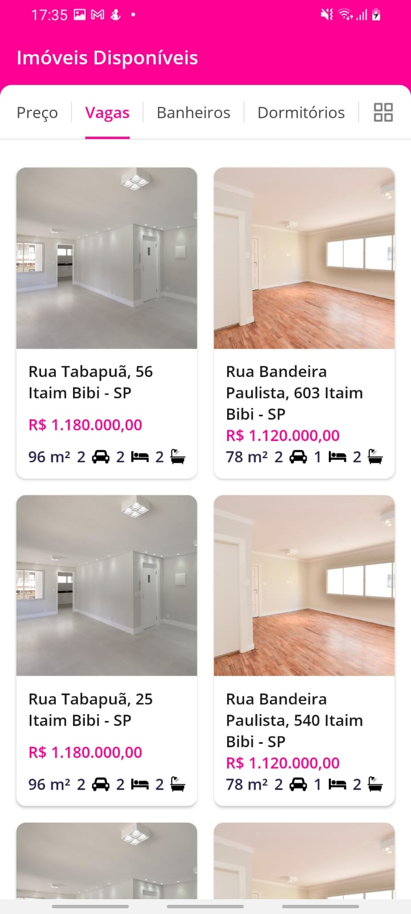
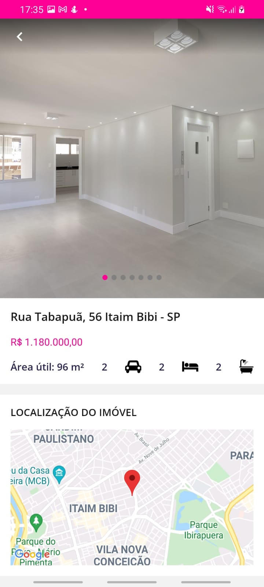

<h1 align="center">
 
  
 
 
</h1>

Keycash Frontend Code Challenge.

Imagens no IOS:.

  
  
  
  
  

Imagens no Android:.

  
  
  
  

<!-- What is: -->

## O que é necessário?

1. _React-native CLI_
2. _Yarn_:

<!-- Links: -->

## Getting started

Pre requisites: To run the react-native project on your mobile or emulator you need some
more specific settings, I recommend this link
(https://facebook.github.io/react-native/docs/getting-started) if you do not already have the recommended settings on your machine.

1. Install
   [Git](http://git-scm.com/downloads) e
   [NodeJS](http://nodejs.org/download/),
   in case you don't have them yet.

2. Clone repository:

   sh
   \$ git clone https://github.com/passeto/keycash-frontend-passeto.git

3) Go to project folder:

   sh
   \$ cd keycash-frontend-passeto

4. Create .env file (copy .env.example):

5. Install all dependences:

   sh
   \$ yarn

6) Finally run:

   sh
   \$ yarn react-native run-android (Android)
   or
   \$ yarn react-native run-ios (IPHONE)

## Generate APK

sh
\$ cd keycash-frontend-passeto

    sh

\$ cd android && ./gradlew assembleRelease

<!-- Create by: -->

## Who's behind this?

Developer passionate about programming and technologies.

_Create by_:

- [Luccas Passeto](http://github.com/passeto)
